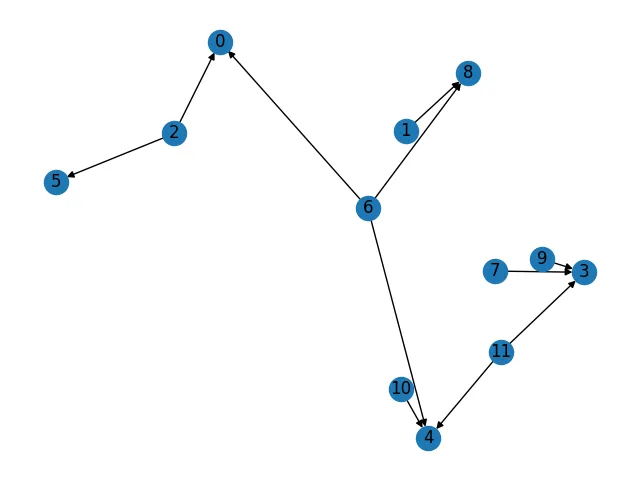
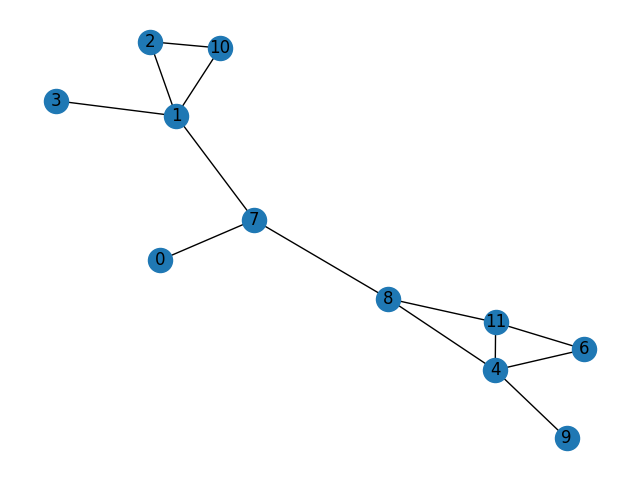

# LISA: HyperLogLog based approximation framework for very big Datasets

( **_If it looks like a duck, swims like a duck, and quacks like a duck, then it probably is a duck._** )

>This project is greatly inspired by the implementation of the HLL algorithm in the Julia library:
> <https://github.com/jakobnissen/Probably.jl/blob/master/src/hyperloglog/hyperloglog.jl>

## Introduction

HyperLogLog definition from the Wiki [1]:
> The basis of the HyperLogLog algorithm is the observation that the cardinality of a multiset of uniformly distributed random numbers can be estimated by calculating the maximum number of leading zeros in the binary representation of each number in the set. If the maximum number of leading zeros observed is n, an estimate for the number of distinct elements in the set is 2**n.[2]

> In the HyperLogLog algorithm, a hash function is applied to each element in the original multiset to obtain a multiset of uniformly distributed random numbers with the same cardinality as the original multiset. The cardinality of this randomly distributed set can then be estimated using the algorithm above.

> The simple estimate of cardinality obtained using the algorithm above has the disadvantage of a large variance. In the HyperLogLog algorithm, the variance is minimized by splitting the multiset into numerous subsets, calculating the maximum number of leading zeros in the numbers in each of these subsets, and using a harmonic mean to combine these estimates for each subset into an estimate of the cardinality of the whole set.[3]

## HyperLogLog as an approximation of datasets

The important part of the algorithm described in Introduction is a collection of subsets that we are using to calculate leading zeros.

Lets look at the process of collecting numbers of leading zeros a little bit closer.

In most implementations of HLL ([4], [5]) this collection presented as an array (vector) and named as registers. The size of the registers vector is usually power of 2. For example, Redis implementation [4] is using 2**13 = 8192 elements.

Here is an algorithm to build registries (regvector) using Python as a pseudo-code:

```python
# Fill registers with zeros
# k is the power of 2 in the formula for the registers size
registers = = [0] * 2**k

for entry in dataset:
  # Calculate hash for each dataset entry
  h_entry = hash_fn(entry)

  # Calculate index of the registry as the first k bits from the h_entry
  # As mentioned Redis takes 13 leading bits
  reg_idx = get_reg_idx(h_entry, k)

  # Count longest sequence of running zeros
  z_num = zero_count(h_entry)

  # Update registers, if calculated z_num greater than 
  # current value in the registers, replace it with z_num
  if z_num > registers[reg_idx]:
    registers[reg_idx] = z_num
  # Or without using if statement
  #  registers[reg_idx] = max(register[reg_idx], z_num)
```

After running this algorithm each element of registers holds a max number of running zeros for each subset of dataset. The subset is associated with k leading bits of the hash value for the elements that belong to this subset.

The registers building algorithm has a few very useful properties:

1. It is an idempotent — it means that running this algorithm against the same dataset will not change the outcome;
2. It creates a single presentation for each dataset — if two registers vectors are different, then the corresponding datasets are different. But this is one way comparison. The same registers for the datasets do not guaranty equivalence of those datasets. So, we have a case of false positives, but we do not have a false negatives when we are comparing datasets using HLL. The datasets with different registers are not equal.
3. (not very useful) The relation between registers and a cardinality of a dataset is not exactly straightforward. Depending on the size of the dataset the calculation formula is needed to be adjusted. It also is not very consistent for different types of data in datasets and even different types of a distribution of those data. These discrepancies are hard to correct in generic way and they are not corrected in the current implementations of HLL.

## Operations in current implementations of HyperLogLog

Most HLL implementation provide support for following operations:

**ADD** — adds an element from a dataset to the registers (it is an internal part of the algorithm described above);

**MERGE** — is using almost the same algorithm as ADD with a slight modification.

```python
# dataset_1 - registers for dataset 1
# dataset_2 - registers for dataset 2
# out - registers for resulting dataset

def merge(dataset_1, dataset_2):
  # Initialize resulting registers
  out = [0] * 2**k
  for i in range(dataset_1.size() - 1):
    # Set out[i] to the max of elements in dataset_1[i] and dataset_2[i]
    out[i] = max(dataset_1[i], dataset_2[i]) 
```
It is obvious that the sizes of all three registers vectors should be the same.

MERGE operation is lossless.

**COUNT** — is the heart of the HLL, it calculates cardinality of the dataset based on the values in the registers.

So, the union is the merge command from HyperLogLog. It is immutable. It doesn’t change the counters of the input datasets but creates a new HllSet as an output.

The **intersect** command is missing in all implementations that I aware of. And there are reasons for this absence. The “obvious” solution to replace max in union with min in intersect doesn’t work. Applying cardinality command to intersection obtained with this “solution” will always return greater estimate of the cardinality — in average around 2 times greater.

It is not enough just to get min of two values in the intersection of two HLLs, we need to modify the result regvector as well. And this is exactly the case when one size doesn’t fit all cases.

So, it’s not a solution. Remember, each register in the registers vector serves all data items from a dataset that have a hash value that starts with the same k bits. These k bits present an identifier of the register. So, potentially any hash with given k bits and number of running zeros less than current number assigned to the register could be there.

On the other hand, the acquired result for registers in the intersection is still holds all properties of the HLL that we mentioned early:

1. It is an **idempotent**.
2. It creates a **single presentation** for each resulting dataset.
3. And, yes — The relation between registers and a cardinality of a dataset is not exactly straightforward.

## Fixing limitations of current implementations of HLL

Even without any changes current implementations of HLL are good enough. The only intersect creates some inconvenience, but it could be resolved with inclusion/exclution formula:

```sql
    card(intersect(A, B)) = (card(A) + card(B)) - card(union(A, B))
```

This way we can get cardinality of an intersection of A and B datasets, but we cannot get the approximated HLL set by itself.

The solution turned out to be very simple. All we need to do is to slightly uprade the data structures of the registers.

From this point we are switching to Julia. The reason is simple - Julia is fast and it has the same convenient features (at least in our context) as Python.

So, here is a new data structure for the registers, we'll start to call them **counters**.

```julia
struct HllSet{P}
    # This is the most important change, we are replacing
    # integer (the max number of running zeros) with 
    # BitVector.
    # This replacement allows us keep all numbers of running
    # zeros for all regesters (we call them bins)

    counts::Vector{BitVector}

    function HllSet{P}() where {P}
        validate_P(P)
        n = calculate_n(P)
        counts = create_bitsets(n)
        return new(counts)
    end

    # This is what Copilot recommend us to do. We think it's not bad.
    function validate_P(P)
        isa(P, Integer) || throw(ArgumentError("P must be integer"))
        (P < 4 || P > 18) && throw(ArgumentError("P must be between 4 and 18"))
    end

    function calculate_n(P)
        return 1 << P
    end

    function create_bitsets(n)
        return [falses(64) for _ in 1:n]
    end
end
```

With BitVector, we defining max number of running zeros as the biggest index in the BitVector that holds "1".

## HllSet operations

### 1. Adding new items to HLL (add)

There are two version for this function:

1. Supports adding a single item:
2. Supports adding multiple items as a set.

```julia
function add!(hll::HllSet{P}, x::Any) where {P}
    h = hash(x)
    bin = getbin(hll, h)
    idx = getzeros(hll, h)
    hll.counts[bin][idx] = true
    return hll
end

function add!(hll::HllSet{P}, values::Set) where {P}
    for value in values
        add!(hll, value)
    end
    return hll
end
```

### 2. Union (union)

Operation **union** is a substitute for the **MERGE** operation in traditional HLL implementation.

```julia
function Base.union!(dest::HllSet{P}, src::HllSet{P}) where {P}
    length(dest.counts) == length(src.counts) || throw(ArgumentError("HllSet{P} must have same size"))
    for i in 1:length(dest.counts)
        dest.counts[i] = dest.counts[i] .| src.counts[i]
    end
    return dest
end
```

Normally we would use **max** of two integers in 

```julia
dest.counts[i] = max(dest.counts[i], src.counts[i])
```

but with a new **struct** that represents HLL structure, we are using bitwise OR (.|) operation for BitVectors.

### 3. Intersection (intersect)

Intersection is a new operation, it is possible only because we switched from **Vector(Int)** to the **Vector(BitVector)** in struct definition of **counters**.

```julia
function Base.intersect(x::HllSet{P}, y::HllSet{P}) where {P} 
    length(x.counts) == length(y.counts) || throw(ArgumentError("HllSet{P} must have same size"))
    z = HllSet{P}()
    for i in 1:length(x.counts)
        z.counts[i] = x.counts[i] .& y.counts[i]
    end
    return z
end
```

Return value of this fumction is a HllSet that we can use in other operations on a collection of HllSets.

### 4. Difference (diff)

```julia
function Base.diff(x::HllSet{P}, y::HllSet{P}) where {P} 
    length(x.counts) == length(y.counts) || throw(ArgumentError("HllSet{P} must have same size"))
    z = HllSet{P}()
    for i in 1:length(x.counts)
        z.counts[i] = x.counts[i] .& .~(y.counts[i])
    end
    return z
end
```

### 5. Derivative (delta)

Derivatives definition from [9]:

> The derivative of a function describes the function’s instantaneous rate of change at a certain point. Another common interpretation is that the derivative gives us the slope of the line tangent to the function’s graph at that point.

Fundamentally all we need for implementing derivative is to implement an operation or a function that can measure changes in the HLL that is built from the given dataset.

Suppose we have recorded states of the HLL at two time-points: hll(t(1)) and hll(t(2)).

The difference between these two states can be described as a triple

```sql
delta(t(1), t(2)) = ( D, R, N),

where

D — is a cardinality of deleted items;
R — is is a cardinality of retained items;
N — is a cardinality of new items.
D(t(1), t(2)) = hll(t(1)).card — ( hll(t(1)).intersect( hll(t(2))).card

R(t(1), t(2)) = (hll( t(1) ).intersect(hll( t(2))).card

N(t(1), t(2)) = hll(t(2)).card — (hll( t(1)).intersect( hll(t(2))).card
```

### 6. Gradient (grad)

We can also define a gradient of the changes, for example, as an euclidean distance between delta vectors (it’s not the only choice and, maybe, not the best, but we can use it as an illustration):

```julia
function grad(v1::Vector, v2::Vector)
    return norm(v1, v2)
end

grad = grad(delta(t(1), t(2)), delta(t(2), t(3)))
```

## Proving that HllSet is a Set

The operations on sets should satisfy following properties [7]:

```julia
"""
Fundamental properties:
    Commutative property
                1. (A ∪ B) = (B ∪ A)
                2. (A ∩ B) = (B ∩ A)
        Associative property
                3. (A ∪ B) ∪ C) = (A ∪ (B ∪ C))
                4. (A ∩ B) ∩ C) = (A ∩ (B ∩ C))
        Distributive property:
                5. ((A ∪ B) ∩ C) = (A ∩ C) ∪ (B ∩ C)
                6. ((A ∩ B) ∪ C) = (A ∪ C) ∩ (B ∪ C) 
        Identity:
                7. (A ∪ Z) = A
                8. (A ∩ U) = A
Some additional laws:        
        Idempotent laws:
                9. (A ∪ A) = A
                10. (A ∩ U) = A
"""
```

Source code for proving that HllSet satisfies all of these requirements you can find in **lisa.ipynb**.

## HllSet special cases

We believe that HLL can be used for approximation of almost any type of data. Here we are providing couple special cases.

In **lisa.ipynb** you can find a demonstration of using HLL to approximate image files. This code is just a demo and the purpose of it is to prove that we can approximate image into HLL.

In addition this code also demonstrates that we can combine images and texts in a single HLL (test_image.py). To run this code you need to use your own images (batteries are not included).

## Relations on collection of HllSets

As we learned, HllSet encapsulates dataset into fixed size regvector of ranks (max numbers of running zeros in the hash that starts with bits representing register index). There is no direct way to restore the original dataset values from the HllSet registers vector.

However, one thing is still given, any changes in the original dataset will most likely affect a corresponding HllSet. So, even we cannot manage the datasets content that we used to generate HllSets but we can perform some operations and measure their changes using proposed operations on HLLs.

We will touch only some binary relations on a collection of HllSets, specifically:

- directed and
- undirected

graphs.

### Directed Graphs

Two HllSets (hll_1 and hll_2) are connected from hll_1 to hll_2, if the following statements are true:

1. hll_1.dependence(hll_2) > hll_2.dependence(hll_1)
2. hll_1.dependence(hll_2) > threshold.

Threshold is a value from [0, 1]. Normally it should be greater than 0.5 at least, but in some cases it could be lower.

Source code for this demo you can find in **lisa.ipynb** as well.



### Undirected Graph

The building of undirected graphs uses almost the same code, but with the tolerance operator:

hll_1.tolerance(hll_2) > threshold (threshold = 0.3).



## Summary

The purpose of this project is to offer you a slightly different perspective on a well-known computing phenomenon - HyperLogLog. We believe that the scope of HyperLogLog is much wider than just calculating the cardinality of a set.

Essentially, we can do most of the analytical work without accessing the actual data, but using the HLL representation of it. Such operations include searching for data, constructing structural groupings, assessing the proximity of distributions of values ​​in compared sets, etc.

## References

1. https://en.wikipedia.org/wiki/HyperLogLog
2. https://algo.inria.fr/flajolet/Publications/FlFuGaMe07.pdf
3. https://static.googleusercontent.com/media/research.google.com/en//pubs/archive/40671.pdf
4. https://redis.io/docs/data-types/probabilistic/hyperloglogs/
5. https://github.com/ascv/HyperLogLog/blob/master/README.md
6. https://en.wikipedia.org/wiki/Inclusion%E2%80%93exclusion_principle
7. https://en.wikipedia.org/wiki/Algebra_of_sets
8. https://github.com/karpathy/micrograd
9. https://www.khanacademy.org/math/differential-calculus/dc-diff-intro
10. https://www.academia.edu/67413396/How_Various_Irrationalities_Proven_to_be_Rational?email_work_card=view-paper    
11. https://blog.apnic.net/2021/06/04/storing-and-retrieving-ip-prefixes-efficiently/
