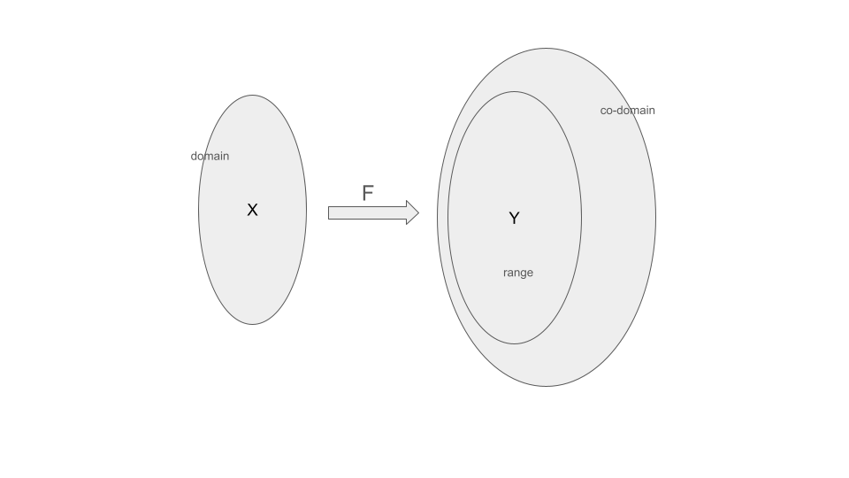
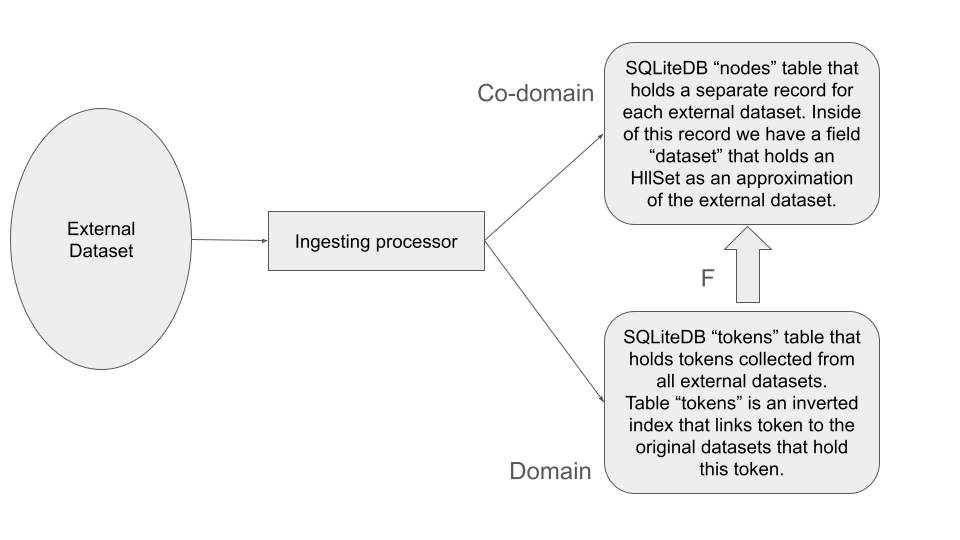
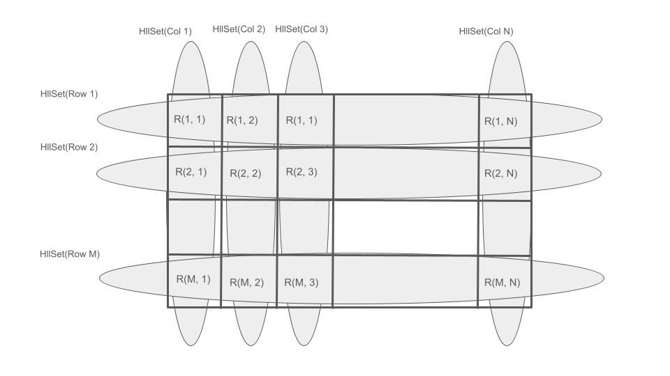

# Lisa Analytics

Lisa Analytics is a collection of topics related to applying a set theory ideas to the HllSets in the context of metadata.

## Domains and co-domains

> ***A thought, once spoken, is a lie.*** Fyodor Tyutchev Silentium!

In mathematics the concept of a domain and co-domain is associated with the function:

 $$ F: X \to Y. $$

The **domain** of the function is the set of all inputs to the function.

The set of possible outputs is a **co-domain**.

**X** is a set of elements from domain, and **Y** is a range of values from the co-domain that corresponds to the elements from the input set.

In **lisa_meta** the **domain** is the set of all possible formats of elements from external datasets. In computers everything eventually ends being a binary code. The difference between a text and an image lays in the way how we are interpreting these bits.

In **lisa_meta** this interpretation/conversion is done by implementing different specialized processors to deal with different data types. So far, **lisa_meta** implemented a limited support for working with csv files. Actually we are reading only textual data (strings) from those file for now.  

What is important, in this diagram each **token** from inverted index **tokens** is converted to the **hash** (unsigned 64 bit integer). This **hash** serves as a **token ID** in **tokens** index.

In the **nodes** table each token ID is placed into the **HllSet** assigned for a given external dataset. **HllSet** is not just collection of another elements. It is a structure (kind of tensors) that has fixed number of rows (we called them **bins**) and each **bin** is a 64-bit BitVector. So, it is a 2 dimensional tensor after all.  

The number of rows in this tensor is power of 2 - $2^p$, currently we are using $p = 10$. This allows us to keep the size of HllSet small enough (around 8KB) with a good accuracy of the cardinality calculation. **Note**, this size is a constant and it doesn't depend on the original dataset size. So, basically any dataset can be encoded in the HllSet not bigger than 8KB. If we need more precise cardinality estimation we can always increase it with bigger $p$.

The assignment algorithm is quite simple:

 1. We determine the **bin** number as an integer represented by first $p$ bits in the token ID **hash**. For example, with $p = 10$, **bin** numbers are in the interval $\left[0, 1024\right]$.
 2. Then we are calculating the number of tailing $0$ in the binary presentation of the token **hash**. This number cannot be bigger than $64 - p$.

So, the power set for all possible HllSets is $(2^{(64 -p)})^{2^p}$. This is actually a very big number :).

However, even that number is not big enough, it is still smaller than a power Set of the all tokens in the **tokens** index. It is also obvious that different **hashes** from **tokens** table after conversion may have the same pair $(bin, zeros)$ as a presentation in the **HllSet**.

Function $F$ is a "many-to-one" map from the **tokens** to the presentation of these tokens in the **HllSet**. It means that, if we are going to trace $(bin, zeros)$ pair from HllSet to the specific token in the **tokens** table, we can end having more than one token. Without the reference to the original dataset, it would be hard/impossible to make a choice of the right from a few of available. By the way it is also possible that more than one of traced tokens may belong to the original dataset due to the possible collision of hash values. The probability of such collisions is very low but not equal $0$.

As a conclusion: once you converted an original dataset to the HllSet, it is hard to figure out a true source for the HllSet presentation. So, "a thought, once spoken, is a lie" has some merits :).

In the **lisa_analytics.ipynb** we'll try to reduce ambiguity of tracing tokens from the HllSet presentation.  

The consistency of conversion datasets to HllSets depends on two factors:

 1. The $p$ parameter that defines the precision of the conversion through the number of bins;
 2. The type of a hash function that we are using.

Specifically, the output from hash function depends on the seed values used in initiating of the hash function. Applying different seed values we can control the generated hashes.

Here is an idea of the algorithm:

 1. We are performing the dataset processing as usual, utilizing standard hash function:

$$F_{(std)}: X_{(std)} \to Y_{(std)}$$

 2. Then we are tracing original tokens by applying back processing:

$$G_{(std)}: Y_{(std)} \to X_{(std)}$$

 3. Now we can perform the same dataset processing using the same hash function but with different seed values:

$$F_{(seed)}: X_{(seed)} \to Y_{(seed)}$$

 4. And we will trace back the results from modified hash function:

$$G_{(seed)}: Y_{(seed)} \to X_{(seed)}$$

It is obvious, that standard and seeded results may not be the same, especially when we are working with very big datasets:

 $$X_{(seed)} \not= X_{(std)}$$

But it is also obvious, that tokens from the original dataset should be in both results.

Does this trick eliminate ambiguity? Maybe, or maybe not.

We hope that an intersection of two results would be closer to a correct one:

$$X = X_{(seed)} \cap X_{(std)}$$

Lets see how it works with some sample data in the **lisa_analytics.ipynb**.

## Applying HllSets for Tabular data structures

Formally tabular datasets can be described as a subset of Cartesian product of two sets:

$$ R(s_1, s_2) \subseteq S_1 \times S_2$$

However, in case of HllSets we do not have access to the elements of sets, so, we need to use a different approach to create and to use tabular structures.

The picture above is an illustration of how we can create binary relations between HllSets. In case of CSV files it will work as following:

1. $S_1$ is a collection of HllSets that represents rows from the CSV file;
2. $S_2$ is a collection of HllSets that represents column of the CSV file;
3. Each cell in the tabular presentation is an intersection of the row HllSet and the column HllSet. So, this intersection is HllSet.

As we learned in Domains and co-domains section, we can always trace the content of any HllSet back to tokens inverted index and get all tokens of the tabular presentation of the cell.

The following things we should keep in mind when we are working with HllSets:

1. The content of the cell is unordered collection of tokens from the original cell of CSV file. So, if you to know the order of those tokens, you should go to original CSV file.
2. In many cases (as in the example that we are providing in the **lisa_analytica.ipynb**) we are using only a sample of rows. So, we should keep it in mind when we are working with this data.
3. The correction is usually is simple:

   1. To get the actual HllSet for column we should use the union of the cell's HllSets of a given column;
   2. The same we should for row HllSets.

The simple example is in the **lisa_analytics.ipynb**.